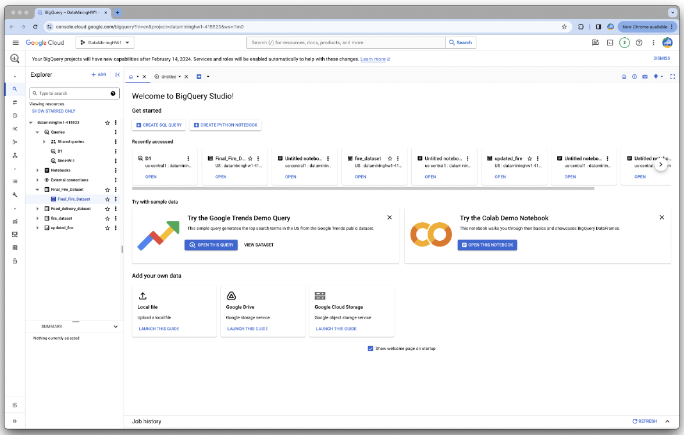
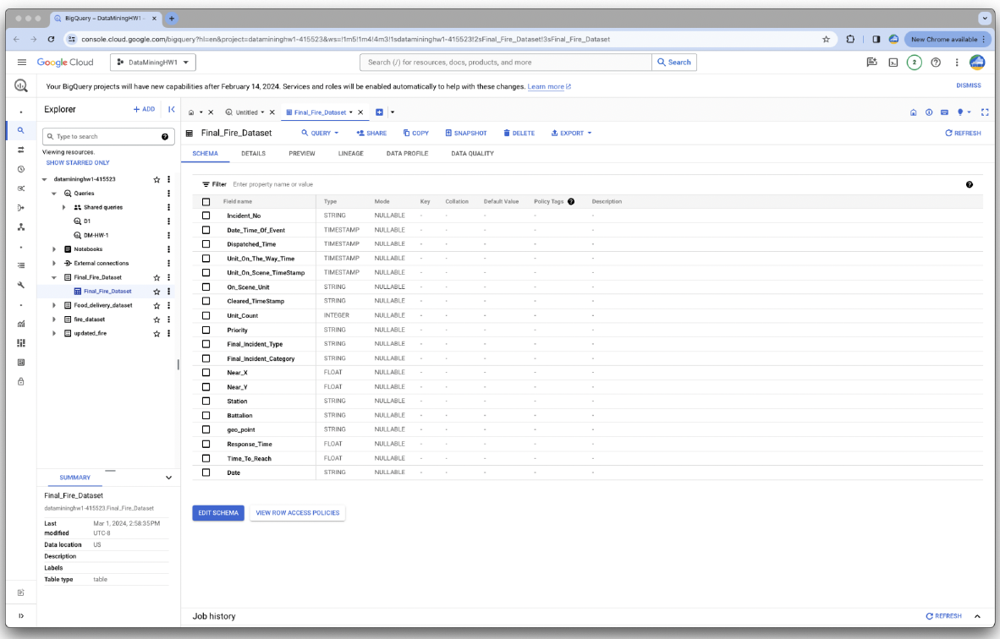
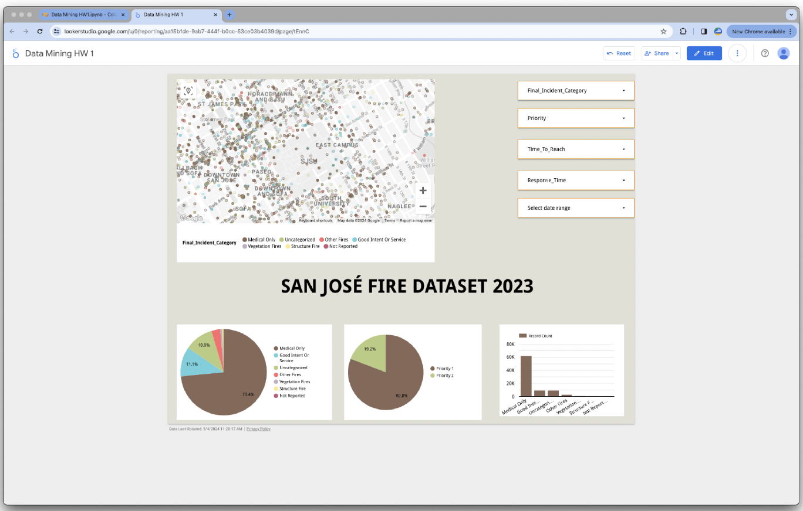
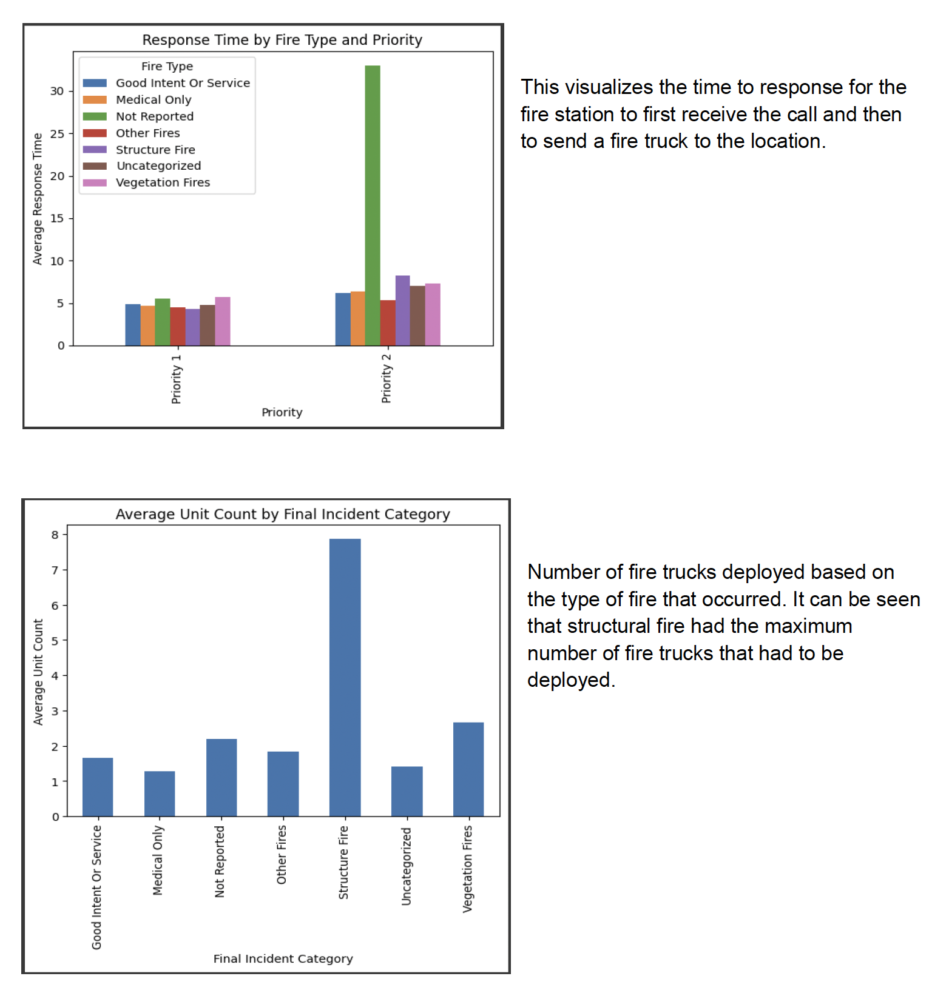
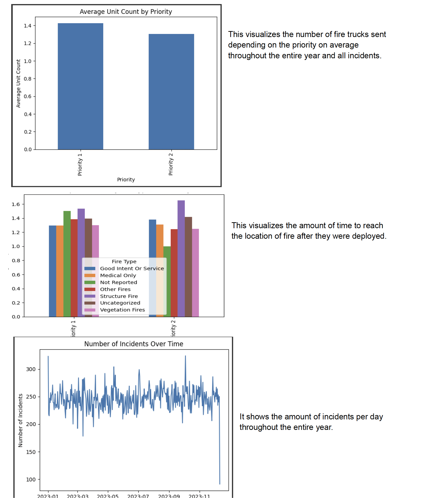

🔥 San José Fire Dataset Analysis and Visualization 🚒

## 🌟 Overview

This project analyzes the **San José Fire Dataset for the year 2023**, containing detailed information on fire incidents such as their priority, number of units deployed, response times, and geographic locations. Using tools like **Google Colab**, **BigQuery**, **Looker Studio**, and **Google Sheets**, we derive insights and create compelling visualizations to better understand fire incidents in San José.

---

## ✨ Features

- **⚙️ Data Preprocessing**: 
  - Cleaned missing values.
  - Added calculated columns like `Response Time`, `Time to Reach`, and geographic coordinates (`Geo_Point`).
- **🔎 Exploratory Data Analysis (EDA)**:
  - Conducted in Python using Pandas for detailed insights into fire incidents.
- **📊 Visualizations**:
  - Interactive dashboards in Looker Studio with filters for **incident type**, **priority**, **response time**, and **date range**.
  - Google Sheets charts for **station performance** and **incident breakdowns**.
- **🚀 BigQuery Integration**: 
  - Hosted dataset on BigQuery for efficient querying and seamless integration with other tools.

---

## 🗂 Dataset Description

| **Field**              | **Description**                                   |
|------------------------|---------------------------------------------------|
| 🆔 `Incident_No`       | Unique identifier for each fire incident.         |
| 🕒 `Date_Time_Of_Event` | Timestamp of the incident.                        |
| 🔺 `Priority`          | Priority level of the incident (e.g., Priority 1).|
| 🔥 `Final_Incident_Type`| Type of fire (e.g., structural fire, false alarm).|
| 🚒 `Unit_Count`        | Number of units deployed.                         |
| ⏱️ `Response_Time`     | Time taken to respond to an incident.             |
| 🌍 `Geo_Point`         | Geographic coordinates of the incident.           |

---

## 🛠️ Tools Used

### 1️⃣ **Google Colab** 🐍
- Preprocessed the dataset by:
  - Cleaning missing values.
  - Adding new columns like `Response_Time`, `Time_To_Reach`, and `Geo_Point` using latitude (`Near_X`) and longitude (`Near_Y`).
- Loaded BigQuery results into Pandas DataFrames for further analysis.

### 2️⃣ **BigQuery** 🗃️
- Efficiently hosted and queried the dataset:
  ```sql
  SELECT *, 
         ST_GEOGPOINT(CAST(near_x AS FLOAT64), CAST(near_y AS FLOAT64)) AS geo_point
  FROM `datamininghw1-415523.fire_dataset.fire_dataset`
  LIMIT 100000;
  ```

  
  
  

### 3️⃣ **Looker Studio** 📊
- Interactive dashboards:
  - 🌍 **Map Visualization**: Incident locations with filters for deeper insights.
  - 🔹 **Pie Charts**: Incident distribution by type and priority.
  - 🔎 **Interactive Filters**: Select **incident type**, **priority**, and **date range**.
 



### 4️⃣ **Google Sheets** 📈
- Connected BigQuery to Google Sheets for additional visualizations:
  - 📊 **Station Performance**: Average number of units deployed by each station.
  - 🔥 **Fire Type Breakdown**: Percentage of incidents by type.
  - ⏱️ **Response Time Trends**: Trends across different categories.

---

## 🎨 Visualizations Summary

### **Google Colab** 🐍
1. 📊 **Response Time Analysis**: Time between call receipt and unit dispatch.
2. 🔥 **Units Deployed by Fire Type**: Structural fires required the most resources.
3. 🔺 **Priority-Based Deployment**: Units deployed based on incident priority.
4. ⏱️ **Time to Reach**: Analysis of unit arrival times.

   
  

### **Looker Studio Dashboard** 📊
1. 🌍 **Map Visualization**: Locations of fire incidents with customizable filters.
2. 🔥 **Incident Distribution**:
   - **By Type**: Structural fires, false alarms, etc.
   - **By Priority**: Priority 1 vs Priority 2 incidents.
3. 🛠️ **Filters**: Incident type, priority, response time, and date range.


  

### **Google Sheets** 📈
1. 🚒 **Station Performance**: Average units deployed by each station.
2. 🔥 **Fire Type Breakdown**: Incident distribution percentages.
3. ⏱️ **Response Time Trends**: Trends across categories.

---

## 📝 How to Use

### Prerequisites
1. Install Python dependencies:
   ```bash
   pip install google-cloud-bigquery pandas matplotlib seaborn
   ```
2. Authenticate with Google Cloud to access BigQuery.

### Steps
1. Clone the repository:
   ```bash
   git clone https://github.com/Rajat123456789/sanjose-fire-analysis.git
   cd sanjose-fire-analysis
   ```
2. Open **`fire-data-visualized.ipynb`** in Google Colab or Jupyter Notebook for preprocessing and EDA.
3. Explore **Looker Studio Dashboards** using the link provided in the repository.
4. Analyze additional charts in **Google Sheets** linked via BigQuery.

---

## 🔍 Results

- 🔥 **Structural Fires** required the most units on average.  
- ⏱️ **Response Times** varied significantly based on priority and station efficiency.  
- 🌍 **Interactive Dashboards** allow filtering by **incident type**, **priority**, and **location** for actionable insights.

---

## 🚀 Future Work
1. 🔮 **Predictive Modeling**: Forecast response times based on historical data.  
2. 🤖 **Automated Pipelines**: Seamlessly integrate BigQuery, Looker Studio, and Google Sheets.  
3. 🌦️ **Extended Analysis**: Incorporate weather and traffic data for deeper insights.

---

## 👥 Contributors
- **Rajat Sharma**  
  🔧 Project Lead & Developer  
  📧 Email: rajat.sharma50486@gmail.com  

---

## 📜 License
Licensed under the **MIT License**.  

With advanced data processing techniques and interactive dashboards, this project offers a clear framework for analyzing and visualizing fire incidents in San José throughout 2023. 🚒✨
